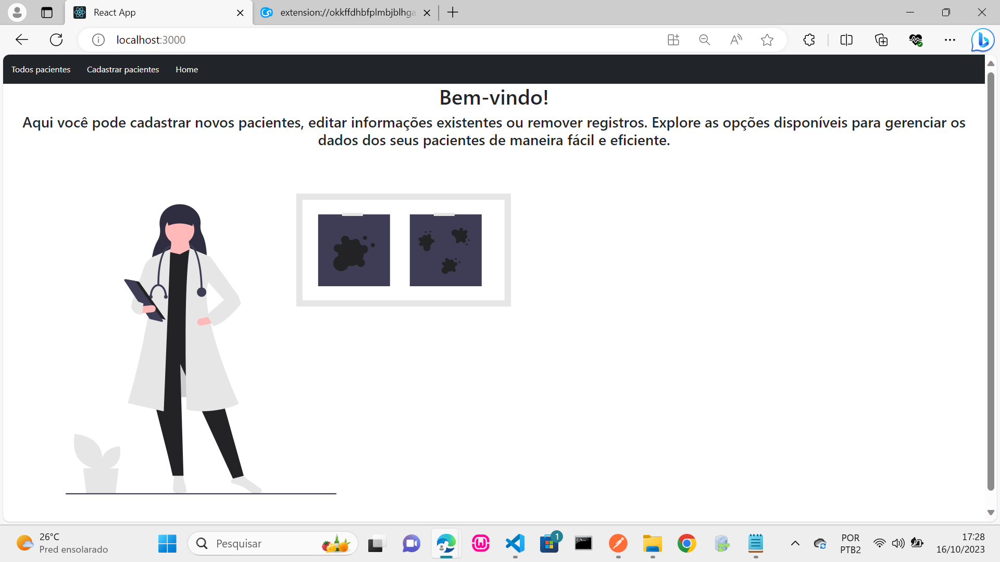
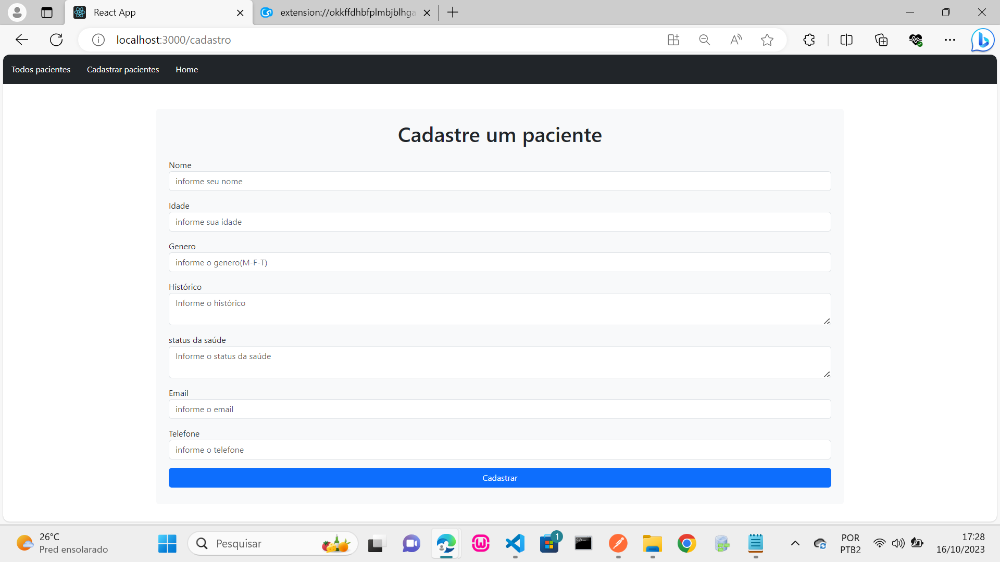
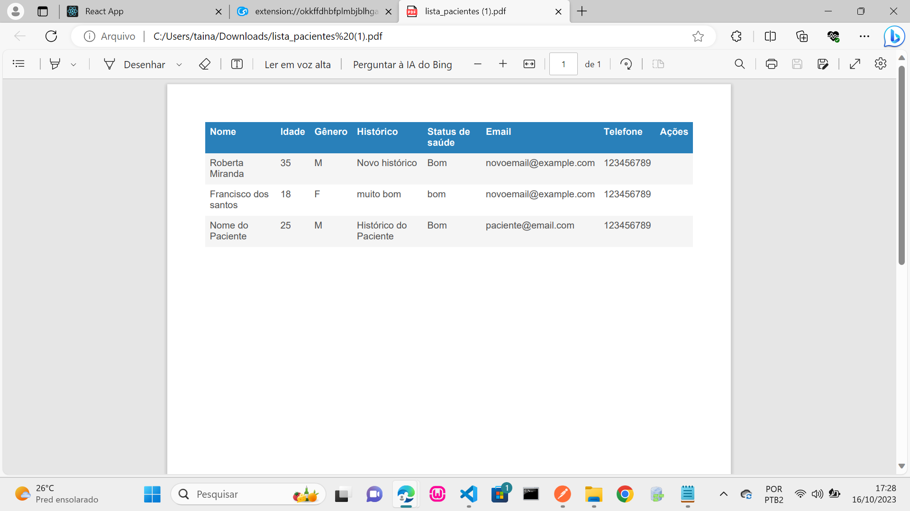
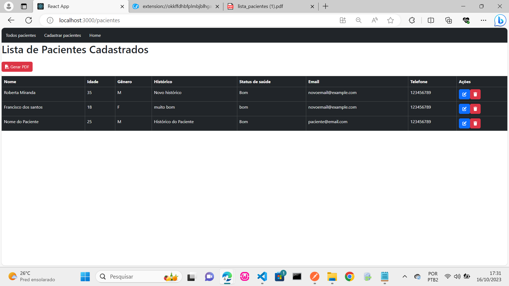

## Projeto Nutri

## react router dom 
## boostrap
## jspdf e jspdf-autotable

### nutri é projeto onde é possivel cadastrar usuarios, editar, apagar usuarios e gerar pdf. O sistema possui verificação de erros nos formulários e também confirmação antes de apagar.

## home

## cadastro

## pdf gerado

## todos os pacientes

### para testar o projeto bastar ter o node instalado juntos com o npm, e dar o coamdno git clone com o link do repositório